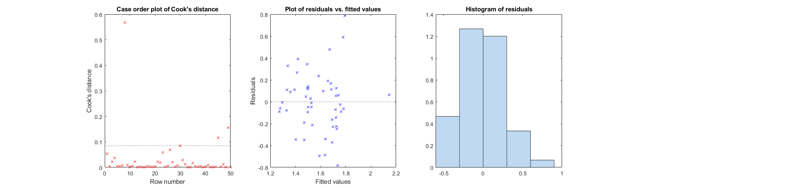

# chopin toolbox
A toolbox mostly for statistical models and formating.

## Description
The toolbox contains various handy functions for manipulating files and data, more 'serious' functions for automatical stastistical analyses, a few stat tools and other handy functions for automatically plotting the data.

## Getting Started
### Dependencies
* Tested on Matlab R2020b
* Tested on Windows 11 pro but should work cross-platforms

### Installing
* download the code
* add its containing folder to your matlab search path

## Content
### Automated GLM (generalized) pipeline
The following functions are used together to easily separate model selection from statistical hypothesis testing. While some statisticians might be horrified by this idea, others argue that it is possible to use non-hypothesis-based metrics like AICc or adjusted R^2 to select for the best model in a first step, check for the numerous validity conditions before selecting the best model, and then do hypothesis testing using this model (using metrics like p-values and effect sizes). Keep in mind that I am not a qualified statistician.
* check_distrib_indep to visualize the shape of dependent variable distribution and test whether normal with Kolmogorov-Smirnov test
* corrplot2 to check collinearity between factors
* all_glm automatically tests and ranks all GLMs as combinations of factors/interactions of factors/link functions
* display_model formats the results in the command window for one model in the list and show diagnostic plots for that model
* plot_group_effect/plot_covariate_effect/plot_interaction: plot the results easily for one model
The following 'typical use' sections should be chained one with the other as a typical pipeline.

### check_distrib_indep
To visualize the shape of dependent variable distribution and test whether normal with Kolmogorov-Smirnov test.

* check for difference between groups using a non-paramatric test
* if not different, group data, otherwise keep separated
* plot dependent variable distributions (line 1: group 1 is on column 1, group 2 on column 2, pooled data on column 3)
* check for normality of the distribution using Kolmogorov-Smirnov test
* if non-normal, attempt to transform the data in log10 and plot it (second line)

#### Typical use
```matlab
% explore which distribution is correct
check_distrib_indep(data.initial_work_mem(data.meditation==1),data.initial_work_mem(data.meditation==2),'initial_work_mem'); % data.initial_work_mem(data.meditation==1) gathers data for the first group
snapnow; %plot figure when publishing markdown code
```
Results obtained:
```
initial_work_mem - Wilcoxon-Mann–Whitney (signed-ranks) U = 800, p = 0.0017
Data are significantly different, so let's keep them separated
Kolmogorov-Smirnov tests for normality:  Group 1 - KS = 0.19, p = 0.2653 and Group 2 - KS = 0.09, p = 0.9626
```


You can see that the distributions are significantly different between groups and should therefore not be pooled. It is normal for each group though, so that 'normal' can be later selected as the distribution for the dependent variable.

### corrplot2
This function is almost identical to corrplot (Matlab included). Use it to check collinearity between factors. As a rule of thumb, only include factors that correlate together less than 0.8/-0.8. Do not include non-ordered categorical variables here.

#### Typical use
```matlab
% Create a table of the factors for conveniency
data_factors = table(data.music,data.sport,data.expect, 'VariableNames',  {'music','sport','expect'});
% Use Kendall correlations that are more powerful when using small samples
corrplot2(data_factors,'type','Kendall')
snapnow; %plot figure when publishing markdown code
```
Results obtained:


Conclusion: no factor to exclude because of collinearity

### all_glm
automatically tests and ranks all GLMs as combinations of factors/interactions of factors/link functions
* you define the data variable, the dependent variable, the distribution
* you define a maximum number of factors to include (as a rule of thumb, you need ~10 datapoints for each, interactions are considered as factors).
* you define a list of liquid and solid factors: solid factors are always included in the list (can be empty), liquid are picked in combination with solid factors until you reach the maximum number of factors. Combinations with a number of factors inferior to the max are also included.
* you define potential model links between the dependend variable and the factors - only include links that make sense, otherwise it may result in errors. Potential links are: 'log', 'reciprocal','identity','-2','-3','probit','logit','loglog','comploglog'
* optionnally exclude some outlier observations (defined as their line number in the data)
* optionnally have warnings off (better to keep them on to discover wrong link functions or wrong data - default is warnings on)
* run all the models and rank them
  
#### Typical use
```matlab
% define a model structure
    % a table with the data, here called data
    model.data = data;
    % the name of the dependent variable in the data structure, here it is data.initial_work_mem
    model.dv = 'initial_work_mem';
    % its distribution among poisson, normal, gamma, inverse gaussian, binomial as previously determined
    model.distribution = 'normal';
    % the maximal nb of factors to explore in the model
    model.max_nb_factors = 3;
    % a factor or a list of factors that are always included in the model (for the moment, works with only one - use '' for none)
    model.solid_factors = {'meditation'};
    % a list of possible factors to be included, that can be removed if needed, and the interactions terms to explore
    model.liquid_factors = {'music','sport','expect','music:meditation','expect:meditation'};
    % a list of potential model links
    model.links = {'log', 'identity'};
    % outliers/subjects to be removed - can be left empty
    model.exclude = [8,12]; 
    % no warnings - careful with that option
    model.warning_off = 1; 

% run the model
mdls = all_glm(model);
```

Results obtained:
```
We tested 30 models.
    Rank                                      formula                                           link         AICc     adj.R2(%)    R2(%)    norm.res.
    ____    ____________________________________________________________________________    ____________    ______    _________    _____    _________

      1     {'initial_work_mem ~ 1 + meditation + music + sport'                       }    {'log'     }    18.619        24       28.7      {'yes'} 
      2     {'initial_work_mem ~ 1 + meditation + music + sport'                       }    {'identity'}     19.18      23.2       27.9      {'yes'} 
      3     {'initial_work_mem ~ 1 + meditation + music'                               }    {'log'     }    19.451      20.7         24      {'yes'} 
      4     {'initial_work_mem ~ 1 + meditation + music'                               }    {'identity'}    19.765      20.3       23.5      {'yes'} 
      5     {'initial_work_mem ~ 1 + meditation + music + music:meditation'            }    {'identity'}    19.925        22       26.8      {'yes'} 
      6     {'initial_work_mem ~ 1 + meditation + music + music:meditation'            }    {'log'     }    20.092      21.8       26.6      {'yes'} 
      7     {'initial_work_mem ~ 1 + meditation + sport'                               }    {'log'     }    20.382      19.3       22.6      {'yes'} 
      8     {'initial_work_mem ~ 1 + meditation + sport'                               }    {'identity'}    20.489      19.1       22.4      {'yes'} 
      9     {'initial_work_mem ~ 1 + meditation + sport + music:meditation'            }    {'log'     }    20.611        21       25.8      {'yes'} 
     10     {'initial_work_mem ~ 1 + meditation + music:meditation'                    }    {'log'     }    20.915      18.4       21.7      {'yes'} 
     11     {'initial_work_mem ~ 1 + meditation + sport + music:meditation'            }    {'identity'}    21.087      20.2       25.1      {'yes'} 
     12     {'initial_work_mem ~ 1 + meditation + music + expect:meditation'           }    {'log'     }    21.184        20       24.9      {'yes'} 
     13     {'initial_work_mem ~ 1 + meditation + music:meditation'                    }    {'identity'}    21.276      17.8       21.2      {'yes'} 
     14     {'initial_work_mem ~ 1 + meditation + music + expect:meditation'           }    {'identity'}    21.409      19.7       24.6      {'yes'} 
     15     {'initial_work_mem ~ 1 + meditation + music + expect'                      }    {'log'     }    21.498      19.5       24.5      {'yes'} 
     16     {'initial_work_mem ~ 1 + meditation + music + expect'                      }    {'identity'}    21.719      19.2       24.1      {'yes'} 
     17     {'initial_work_mem ~ 1 + meditation + expect:meditation'                   }    {'identity'}    21.926      16.7       20.1      {'yes'} 
     18     {'initial_work_mem ~ 1 + meditation + expect:meditation'                   }    {'log'     }    22.027      16.6         20      {'yes'} 
     19     {'initial_work_mem ~ 1 + meditation + expect'                              }    {'identity'}      22.3      16.1       19.5      {'yes'} 
     20     {'initial_work_mem ~ 1 + meditation + expect'                              }    {'log'     }    22.389        16       19.4      {'yes'} 
     21     {'initial_work_mem ~ 1 + meditation + sport + expect:meditation'           }    {'log'     }     22.64      17.7       22.7      {'yes'} 
     22     {'initial_work_mem ~ 1 + meditation + sport + expect:meditation'           }    {'identity'}    22.714      17.6       22.6      {'yes'} 
     23     {'initial_work_mem ~ 1 + meditation + sport + expect'                      }    {'log'     }    22.748      17.5       22.6      {'yes'} 
     24     {'initial_work_mem ~ 1 + meditation + music:meditation + expect:meditation'}    {'log'     }    22.797      17.4       22.5      {'yes'} 
     25     {'initial_work_mem ~ 1 + meditation + sport + expect'                      }    {'identity'}    22.852      17.3       22.4      {'yes'} 
     26     {'initial_work_mem ~ 1 + meditation + music:meditation + expect:meditation'}    {'identity'}    23.041        17       22.1      {'yes'} 
     27     {'initial_work_mem ~ 1 + meditation + expect + music:meditation'           }    {'log'     }    23.093      16.9         22      {'yes'} 
     28     {'initial_work_mem ~ 1 + meditation + expect + music:meditation'           }    {'identity'}    23.357      16.5       21.6      {'yes'} 
     29     {'initial_work_mem ~ 1 + meditation + expect + expect:meditation'          }    {'identity'}    23.462      16.3       21.4      {'yes'} 
     30     {'initial_work_mem ~ 1 + meditation + expect + expect:meditation'          }    {'log'     }    23.491      16.3       21.4      {'yes'} 
```
Models are ranked by lowest AICc. In a glance, you can find the line of the model that satisfies the following conditions:
* low AICc
* positive adjusted R^2
* R^2 that is large enough for you to qualify as a useful model
* Normality of residuals
Once you have a candidate, the next step is to check the validity of that candidate with diagnostics plots.

### display_model 
formats the results in the command window for one model in the list and show diagnostic plots for that model

#### Typical use
```matlab
% display diagnostics and results
display_model(mdls{1}) %plot model ranked 1 - you can select any other models by rank according to the results on the various indicators provided
snapnow; %plot figure when publishing markdown code
```

Results obtained:
```
Generalized linear regression model:
    log(initial_work_mem) ~ 1 + meditation + music + sport
    Distribution = Normal

Estimated Coefficients:
                    Estimate          SE         tStat       pValue  
                   ___________    __________    _______    __________

    (Intercept)        0.72201      0.079764     9.0519    8.7615e-12
    meditation        -0.15073      0.051537    -2.9248     0.0053361
    music            0.0028907      0.001318     2.1933      0.033381
    sport          -1.0764e-05    6.2821e-06    -1.7135      0.093362


50 observations, 46 error degrees of freedom
Estimated Dispersion: 0.0773
F-statistic vs. constant model: 6.17, p-value = 0.00129
AICc: 18.6186
Adjusted R^2: 24%
Residuals: Kolmogorov test for normality (alpha 5%):  KS = 0.10, p = 0.6403
Residuals are normal
```

As you can see, the best model according to AICc shows 
* no outlier (first plot of Cook's distance - no datapoint is both above 1 and far away from the other datapoints - personal criterion)
* a little bit of fanning: in other words, there is more variability of the residuals for larger fitted values. That could possibly be resolved by changing the distribution, the link function or transforming the dependent variable in log. 
* normality of residuals (p = 0.64)
* explain a good share of the variance (R^2 and adjusted R^2 - personal criterion)

Now if you are happy with this model fit, you can decide to look at the stastitics. This model shows a significant effect of meditation and music factors on the dependent variable. This code does not allow yet to calculate effect sizes.

### plot_group_effect / plot_covariate_effect / plot_interaction
plots the results for one model

#### Typical use
```matlab
% add plots of results and save figures
% there is an empty subplot that I like to fill with a figure showing the most interesting result, here a significant meditation group effect
h=subplot(1,4,4);

plot_group_effect(data.initial_work_mem, data.meditation, h, 'Meditation group', 'initial working memory performance', {'Meditators','Non-meditators'}, 0, model)

% save the figure
saveas(gcf,fullfile(figure_path,'results.png')); 
snapnow; %plot figure when publishing markdown code
```


For a continuous factor or an interaction relationship, you can use plot_covariate_effect or plot_interaction instead. The example below plots the effect of music practice in hours on our dependent variable.

```matlab
h=subplot(1,4,4);
plot_covariate_effect(data.initial_work_mem, data.music, h, 'Music practice (hours)', 'initial working memory performance', 0, 0, mdls{1},1,model);
```


This one below looks at an interaction between age group and stereo condition for the Time dependent variable.
```matlab
h=subplot(1,4,4);
plot_interaction(data.Time, data.stereo,data.ageGroup, h, 'Age group (younger / older)','Task completion time (sec)', {'Monocular','Binocular'},mdls{1}, 1, model)
```

Note that the interaction plot code works only with a grouping variable with two levels.

## Authors
Adrien Chopin, 2023
The code is mostly made of codes from other people:
* Bayes Factor from Bart Krekelberg
* Cohen's D from Ruggero G. Bettinardi (RGB) / Cellular & System Neurobiology, CRG
* Shapiro test from Gardner-O'Kearny, William (2021). swft - Shapiro-Wilk/Shapiro-Francia Tests (https://www.mathworks.com/matlabcentral/fileexchange/<...>), MATLAB Central File Exchange. Retrieved March 13, 2021.
* Justin Theiss for check_files / check_folders functions
* sumsqr from Mark Beale, 1-31-92 / Copyright 1992-2017 The MathWorks, Inc.
  
## Version History
* Current version is 1.0
* Version 1.0 includes various handy functions for manipulating files and data, more 'serious' functions for automatical stastistical analyses, a few stat tools and other handy functions for automatically plotting the data.

## License
This project is licensed under the MIT License - see the LICENSE.md file for details.
To use it you may also follow any license for borrowed codes (see Authors section).
